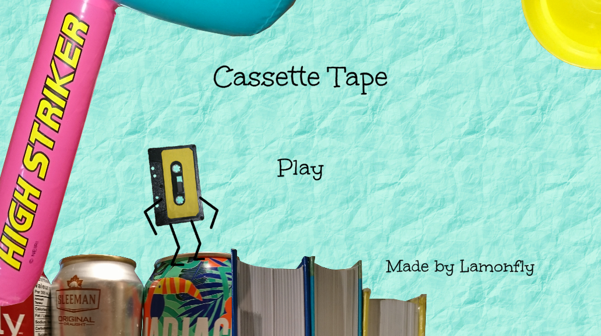
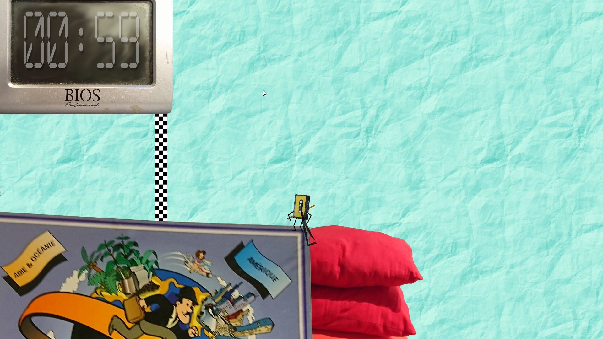
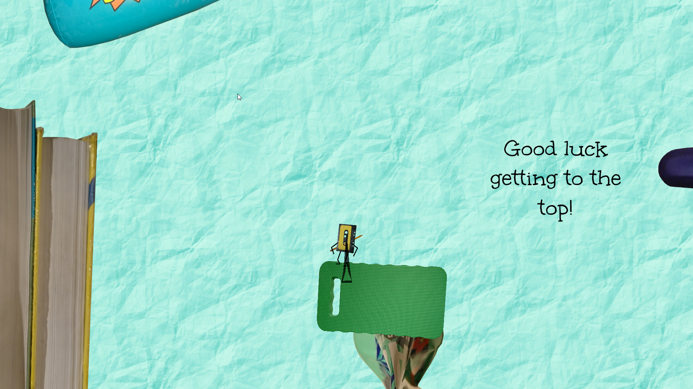
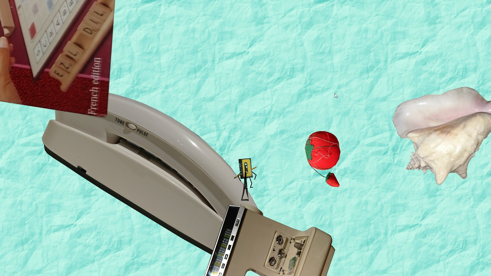

<h2>Cassette Tape</h2>

Cassette tape is a 2d platformer game made with Unity3D for Brackeys Game Jam 2020.2.
The player must use the grappling tape pencil and his special big jump in order to reach the top using any path the fastest way possible.
<h3>Gameplay</h3>

